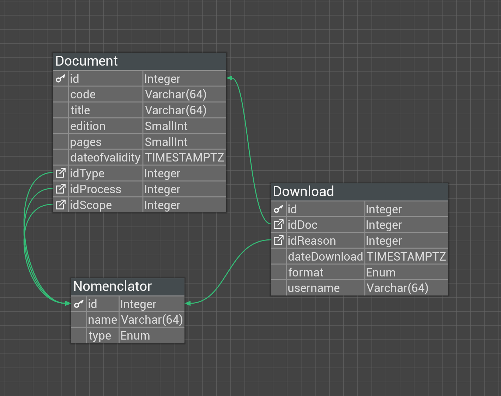

# AicaDocsApi


Proyecto de Práctica I de Ingeniería Informática.

Se creó un sistema de para el control de la documentación para el Sistema
de Gestión de Calidad de la Empresa Laboratorios Farmacéuticos de AICA+.

Se creó una minimal API en Asp.Net Core 8 cumpliendo con todos los requisitos 
capturados.

Se creó una base de datos en `PostgreSql` robusta con dichos requisitos, y para
el almacenamiento de los reficheros se empleó [MinIO](https://min.io/)

## 📖 Problemática

En los Laboratorios Aica se desea llevar un control de la documentación del
Sistema de Gestión de Calidad de la empresa. Esta documentación se organiza
de acuerdo a un alcance, que puede ser Rector (aplica en toda la empresa) o
específico (aplica en una UEB); un proceso, que corresponde con uno de los
procesos definidos en el mapa de procesos de la organización; y un 
tipo de documento, que es definido por los especialistas del Área de Calidad.
De estos documentos se conoce el código, título, edición, páginas, fecha
de vigencia y dos archivos asociados, uno en formato pdf y otro en word. 
Se desea crear un sistema que permita la creación y visualización de esta 
documentación. Para ello, se definen los siguientes requisitos:
- Creación de documentos
- Búsqueda de documentos, con filtros asociados a cada propiedad del documento
- Descargar documentos, donde se especifica que archivo se desea descargar (pdf o word) y un motivo de la descarga


## 🖼️ Modelo físico de la base de datos


## 📶 Configuración de la conexión a la base de datos
Para poder configurar la conexión a la base de datos en PostgreSQL siga los siguientes pasos:
1. Cree/Actualice en la ruta raíz del proyecto un archivo `appsettings.json`
2. En dicho archivo coloque las siguientes líneas, sustituyendo `INFO` por la información 
correspondiente en cada caso: 
``` json
}
    (...),
    "ConnectionStrings": {
        "PostgreSQLConnection": "Server=INFO;Port=INFO;Database=INFO;User Id=INFO;password=INFO"
    }
}
```
3. Si no tiene la base de datos de Aica, en la consola escriba el siguiente comando: `dotnet ef database update`.
Asegúrese que tiene las `Migrations`, si no ejecute antes el comando: `dotnet ef migrations add InitialCreate`

## 📶 Configuración de la conexión a MinIO
> [!IMPORTANT]
> Se debe tener instalado `MinIO Server` y tener configurado el usuario necesario 
> con permiso de escritura-lectura y el `bucket` en el cual se almacenarán los datos
> con la estructura de carpetas `/pdf` y `/word`

Para poder configurar la conexión a MinIO siga los siguientes pasos:
1. Cree/Actualice en la ruta raíz del proyecto un archivo `appsettings.json`
2. En dicho archivo coloque las siguientes líneas, sustituyendo `INFO` por la información
   correspondiente en cada caso:
``` json
}
    (...),
    "Minio": {
       "endpoint": "INFO",
       "accessKey": "INFO",
       "secretKey": "INFO",
       "bucket": "INFO"
    }
}
```

## 🚀 Despliegue
> [!NOTE]  
> No se han desplegado aún la api ni la base de datos.

## 👥 Autores
<table>
    <tbody>
        <tr>
            <td align="center" valign="top" width="40%"><a href="https://github.com/LilyRosa"><br /><sub><b>Lilian Rosa Rojas Rodríguez</b></sub></a><br/> </td>
            <td align="center" valign="top" width="40%"><a href="https://github.com/EduardoProfe666"><br /><sub><b>Eduardo Alejandro González Martell</b></sub></a><br/> </td>
        </tr>
    </tbody>
</table>

## 👥 Tutores
- Dr. Carlos Ramón López Paz
- Msc. Ana Lilian Infante Abreu

## 👥 Especialistas
<table>
    <tbody>
        <tr>
            <td align="center" valign="top" width="70%"><a href="https://github.com/pedrydev"><br /><sub><b>Ing. Pedro Velázquez Borrero</b></sub></a><br/> </td>
        </tr>
    </tbody>
</table>
